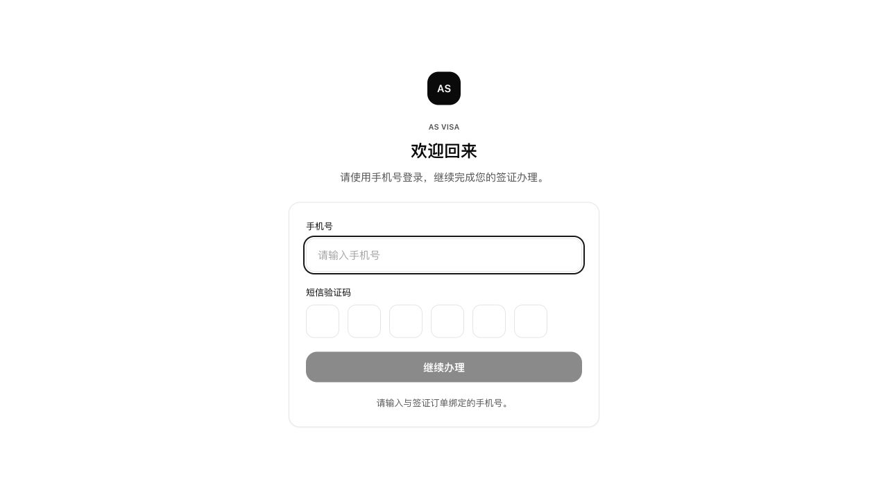
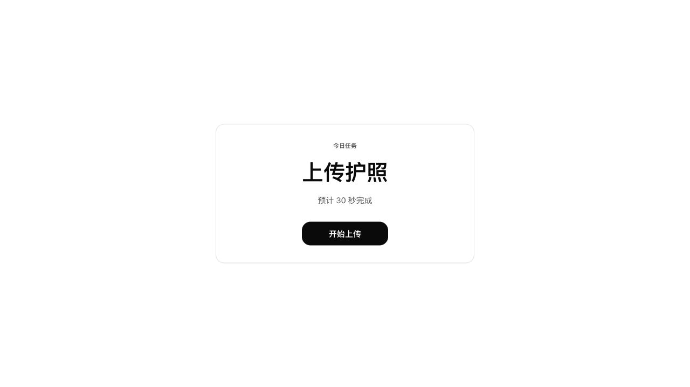
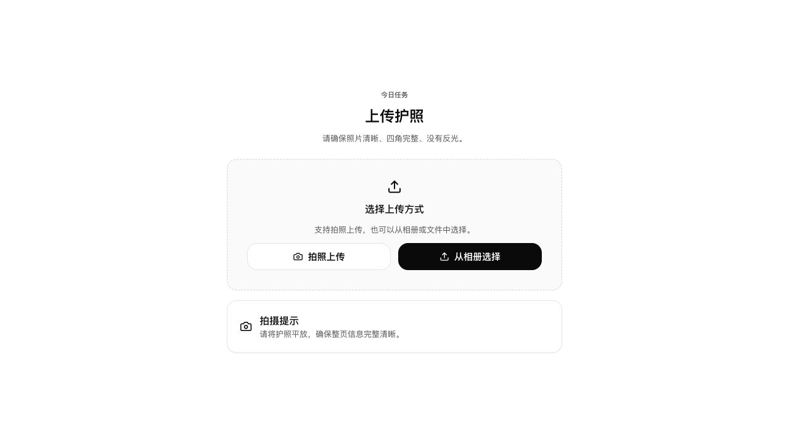
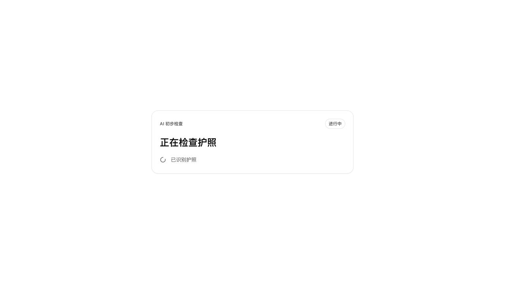
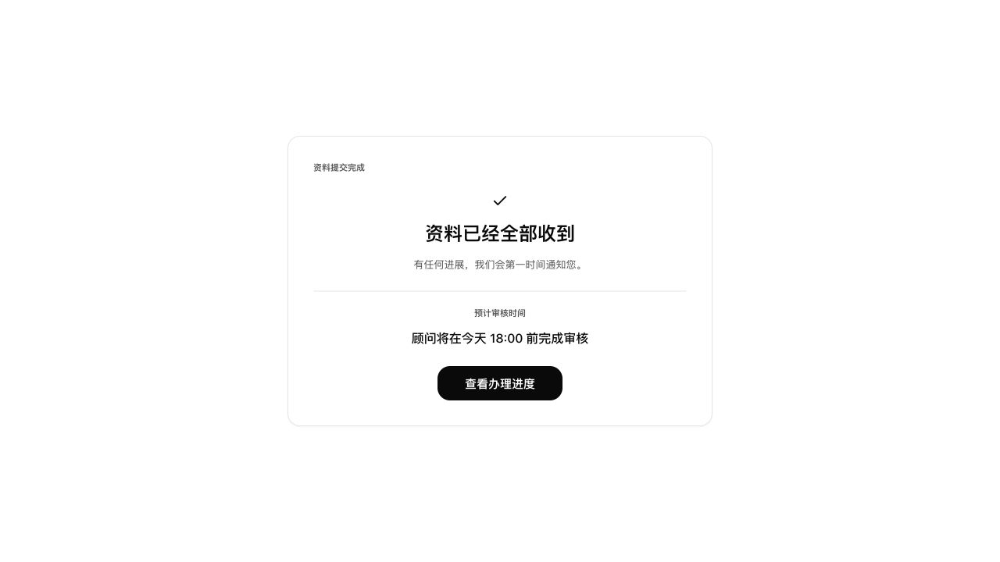
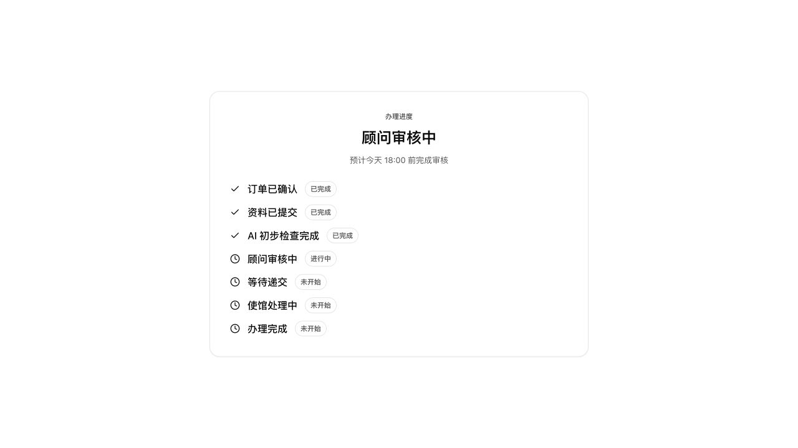

# AS VISA Milestone 1 Fix Review

## Summary

This fix pass improves the current customer MVP flow only.

No admin pages, Enterprise WeChat integration, real AI, new business modules, or dashboard experiences were added.

## Files Changed

- `apps/customer/app/login/LoginExperience.tsx`
- `apps/customer/app/mission/page.tsx`
- `apps/customer/app/upload/page.tsx`
- `apps/customer/app/upload/upload.module.css`
- `apps/customer/app/upload-passport/page.tsx`
- `apps/customer/app/upload-passport/upload-passport.module.css`
- `apps/customer/app/ai-review/page.tsx`
- `apps/customer/app/completion/page.tsx`
- `apps/customer/app/progress/page.tsx`
- `apps/customer/app/notifications/page.tsx`
- `apps/customer/app/profile/page.tsx`
- `apps/customer/app/layout.tsx`
- `apps/customer/app/lib/missionFlow.ts`
- `packages/ui/src/components/Progress/Progress.tsx`
- `packages/ui/src/components/Upload/Upload.tsx`
- `packages/ui/src/styles.css`
- `docs/Product/milestone-1-fix-review.md`
- `docs/Design/screenshots/milestone-1-fix/login.png`
- `docs/Design/screenshots/milestone-1-fix/mission.png`
- `docs/Design/screenshots/milestone-1-fix/upload.png`
- `docs/Design/screenshots/milestone-1-fix/ai-review.png`
- `docs/Design/screenshots/milestone-1-fix/completion.png`
- `docs/Design/screenshots/milestone-1-fix/progress.png`

## What Was Fixed

- Converted customer-facing MVP copy to calm, professional Chinese.
- Updated login copy for Chinese Douyin visa customers.
- Improved Mission page copy so it shows one current task only.
- Renamed the dynamic upload route from `/upload-passport` to `/upload`.
- Kept `/upload-passport` as a safe redirect to `/upload` so existing links do not break.
- Improved upload copy for passport, ID card, and bank statement missions.
- Updated upload actions to `拍照上传` and `从相册选择`.
- Updated upload success messages to Chinese.
- Updated AI review states to Chinese:
  - `正在检查资料...`
  - `已识别护照`
  - `已识别身份证`
  - `已识别银行流水`
  - `正在检查有效期`
  - `正在检查完整性`
  - `初步检查完成`
- Updated completion page copy for the China customer flow.
- Updated progress timeline to the simplified Chinese status model.
- Updated profile and notification copy to Chinese.
- Changed NOIR button radius away from full pill styling to 16px.
- Preserved the minimal black, white, and gray visual direction.
- Added MVP mock data comments near `missionFlow`.

## Screenshots

Login:



Mission:



Upload:



AI review:



Completion:



Progress:



## Verification

Typecheck passed:

```bash
npm run typecheck:ui
npm --workspace apps/customer run typecheck
```

Production build passed:

```bash
npm --workspace apps/customer run build
```

Build confirmed both routes:

- `/upload`
- `/upload-passport`

## Remaining TODO

- Replace MVP localStorage mission state with Rule Engine generated document checklist.
- Replace mock login with real SMS authentication.
- Replace simulated AI review with real AI review once backend boundaries are ready.
- Add browser/device QA on actual mobile Safari and WeChat embedded browser.
- Add automated flow tests for login, mission switching, upload route, AI review transition, completion, and progress timeline.
