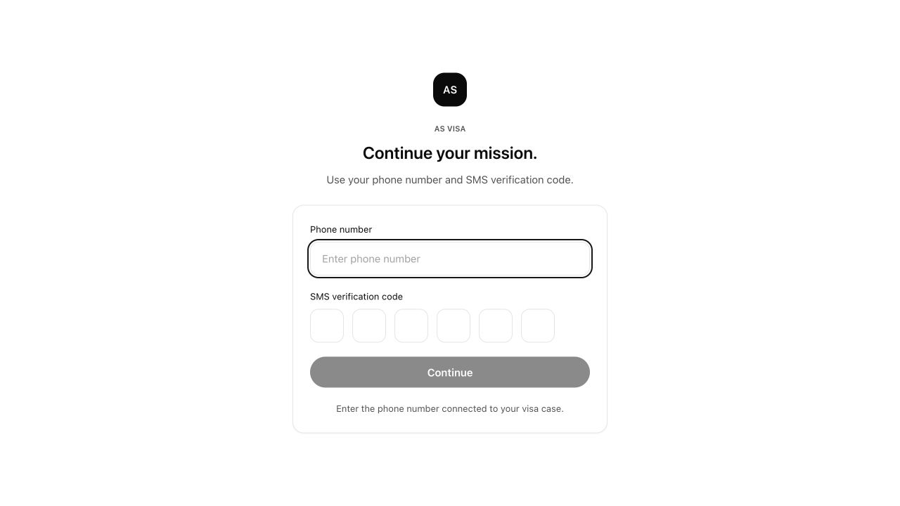
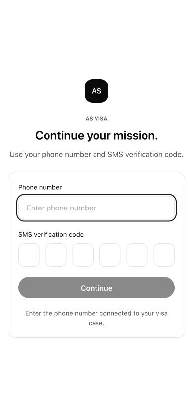
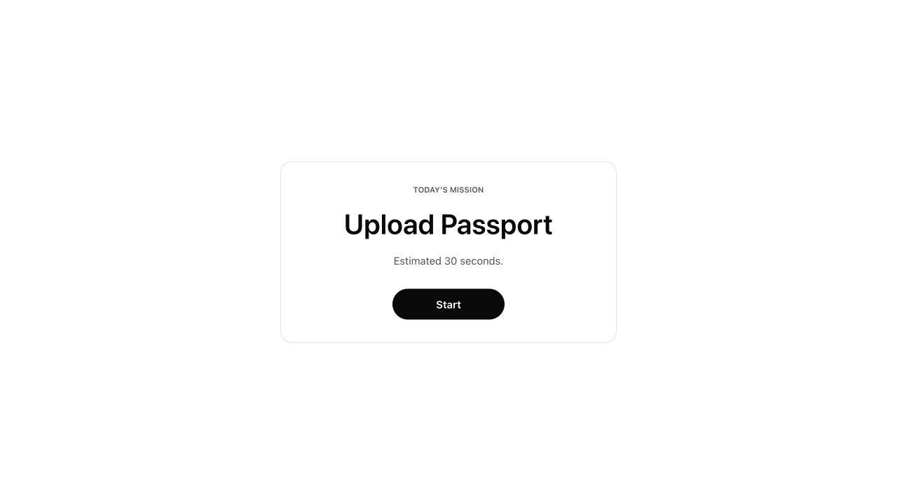

# AS VISA Sprint 4 Review Report

## Scope

Sprint 4 delivered the first Login Experience for the customer app.

The implementation stays within the sprint boundary:

- One login screen only.
- Centered AS VISA logo.
- Phone number input.
- SMS verification code input.
- Primary continue button.
- Responsive layout.
- Minimal interaction.
- Successful local verification routes to the Mission placeholder.

No dashboard, sidebar, admin page, or extra navigation was introduced.

## New Files Created

Sprint 4 implementation files:

- `apps/customer/app/login/page.tsx`
- `apps/customer/app/login/LoginExperience.tsx`
- `apps/customer/app/login/login.module.css`
- `apps/customer/app/mission/page.tsx`
- `apps/customer/app/mission/mission.module.css`
- `docs/Product/sprint-4-login-experience.md`

Sprint 4 review assets:

- `docs/Product/sprint-4-review-report.md`
- `docs/Design/screenshots/sprint-4/login-production-viewport.png`
- `docs/Design/screenshots/sprint-4/login-production-mobile-viewport.png`
- `docs/Design/screenshots/sprint-4/mission-production-viewport.png`

## Files Modified

Current Sprint 4 flow depends on these existing project files:

- `apps/customer/app/page.tsx`
  - Routes the customer app entry point to `/login`.
- `apps/customer/app/lib/missionFlow.ts`
  - Provides the current mission state used after successful login.
- `packages/ui/src/components/Button/Button.tsx`
  - Supplies the primary/loading button API.
- `packages/ui/src/components/Inputs/Inputs.tsx`
  - Supplies `PhoneInput` and `OTPInput`.
- `packages/ui/src/components/Cards/Cards.tsx`
  - Supplies the reusable `Card` surface.
- `packages/ui/src/styles.css`
  - Supplies NOIR design tokens and shared component classes.

No database, AI, upload, or business authentication logic was added for Sprint 4.

## Folder Structure

```txt
apps/
  customer/
    app/
      login/
        page.tsx
        LoginExperience.tsx
        login.module.css
      mission/
        page.tsx
        mission.module.css
      lib/
        missionFlow.ts
      page.tsx

packages/
  ui/
    src/
      components/
        Button/
        Inputs/
        Cards/
      styles.css
      tokens/

docs/
  Product/
    sprint-4-login-experience.md
    sprint-4-review-report.md
  Design/
    screenshots/
      sprint-4/
        login-production-viewport.png
        login-production-mobile-viewport.png
        mission-production-viewport.png
```

## Screenshots

Desktop login:



Mobile login:



Mission placeholder after successful login:



## Design Decisions

- The screen is intentionally centered and quiet to preserve the NOIR design direction.
- The AS VISA logo is reduced to a compact black mark so the user focuses on the single mission: secure access.
- The copy uses direct action language: "Continue your mission."
- The form uses only reusable UI package components: `Card`, `PhoneInput`, `OTPInput`, and `Button`.
- The primary button remains disabled until the phone number and 6 digit SMS code are present.
- `aria-live` is used for the small status message so verification feedback can be announced without adding visual noise.
- Motion is limited to a soft entrance transition and respects reduced-motion preferences.
- The post-login destination is a placeholder Mission page, not a dashboard.

## Verification

Production build passed:

```bash
npm --workspace apps/customer run build
```

Screenshots were captured from the production server at:

```txt
http://localhost:3001/login
http://localhost:3001/mission
```

## Remaining TODOs

- Replace local verification with real SMS authentication.
- Connect login state to Supabase auth/session storage.
- Add validation for unsupported phone formats.
- Add resend-code and rate-limit behavior after authentication requirements are finalized.
- Add failed verification and expired-code states.
- Confirm final mobile QA on a real device/browser before production release.
- Add automated interaction tests for disabled/enabled submit behavior and successful route transition.
